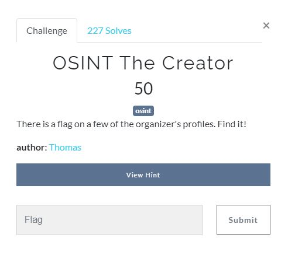
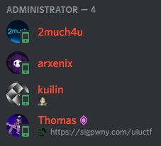
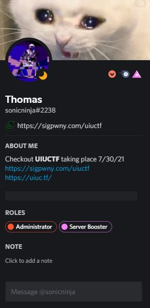
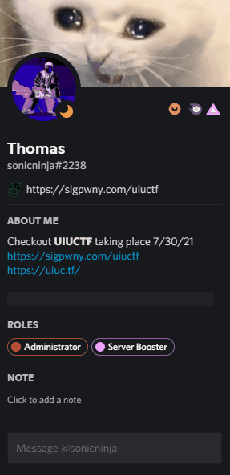

# OSINT The Creator

## Introduction



To solve the *OSINT The Creator* challenge, you just have to do some simple research.
Thanks to the description we quickly understand that the flag is on one of the **profiles of the creator** of this challenge.
It's indicated that the author is "**Thomas**".

Using the hint (which was: "*It's on Discord :)*"), you have to look for the discord of dear Thomas.

## Research

<ins>Two cases are possible:</ins>
    - Thomas has the name "Thomas" on Discord
    - Thomas doesn't have the same Discord name.

Fortunately for us, we see that an admin is called Thomas, it's probably him :D.
If it wasn't the case, we would have had to search the word Thomas in the Discord server via the search tool, or find a social network and compare the nicknames.



If he wasn't online, just look at the announcement messages and we would have seen an admin named Thomas.
We **click on his profile** and we get this:



## Flag

We see that **there is a spoiler** in its description, how about opening it?



Pretty cool Discord right?
```
uiuctf{@b0uT_m3_suppOrT5_maRkD0wN}
```

*This is my very first writeup, I hope you liked it ;)*